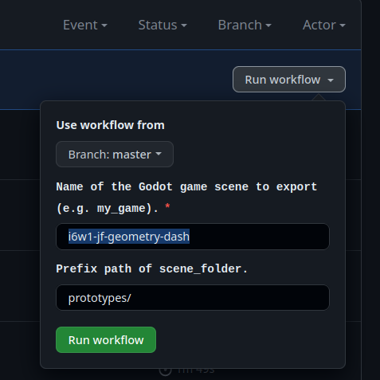

# Iteration 6 Week 2

## HealthBar

Add invulnerability to HealthBar with an additional option to enable/disable healing when invulnerable. The user can also specify a color for the border that is displayed around the HealthBar when the HealthBar is invulnerable.


## Deployment to Github Pages

We wanted to create an easy way of uploading your game to the web.

To achieve this, we have created a github workflow based on [https://hub.docker.com/r/barichello/godot-ci/](https://hub.docker.com/r/barichello/godot-ci/) for exporting godot/pronto prototypes and deploying them to Github Pages.

To start the workflow you first have to run a new workflow after pushing your game to a branch. After that a new window appears where you first need to select the branch. You also need to provide the name of your game (the name of the folder containing your scenes and **all game assets!**). If the parent directory deviates from `prototypes` the prefix path can be adapted.



If you want Github Pages to show more information about your game you can place a `game_info.json` file into your game folder ([Documentation](https://github.com/hpi-swa-lab/godot-pronto/blob/gh-pages/README.md)):

```json
{
  "title": "My Game",
  "description": "The description of my game that is displayed in the overview.",
  "authors": ["Developer 1", "Developer 2"],
  "thumbnailType": "png"
}
```

The workflow will no run a godot docker container. Using the script `scripts/export.sh` an export config `export_presets.cfg` is created containing all pronto files and your game. After the godot export terminates the `build/web` folder containing the export is committed to the [gh-pages](https://github.com/hpi-swa-lab/godot-pronto/tree/gh-pages) branch under a subfolder with your game name.

You can now open [https://hpi-swa-lab.github.io/godot-pronto/](https://hpi-swa-lab.github.io/godot-pronto/). Your game should be displayed with some basic information as well as a play button for starting the game.


### Github Pages vs ITCH.IO

We first tried to directly deploy to [itch.io](https://itch.io). This can be achieved through using [butler](https://itch.io/docs/butler/) in our workflow. The problem we encountered is that `butler` is only able to upload game files to existing projects and is not able to create new projects itself. Because each itch project can only hold one game, it requires the manual process of first creating the project yourself if you don't want each game export to overwrite the previous. Also the `SharedArrayBuffer` option needs to be set manually. One other point is that `itch.io` only supports 20 projects for the normal free tier.

With Github Pages we can deploy completely automated (once you have entered the inputs like `project_folder`). We have an `index.html` file which automatically looks for all games deployed and displays them accordingly. With this solution we are not bound at any restrictions like the number of games. We also have full control on how to display the individual games. For instance a title, description and thumbnail can be provided.


### Pitfalls/Issues

When I created the `export.sh` the workflow was unable to execute it. This was caused by Windows, because it doesn't set the correct permissions. Luckily I found this: [GitHub Actions: Fixing the 'Permission Denied' error for shell scripts](https://dev.to/aileenr/github-actions-fixing-the-permission-denied-error-for-shell-scripts-4gbl).

The command `git update-index --chmod=+x export.sh` has to be executed locally in order to allow the script to be executed in the workflow.
